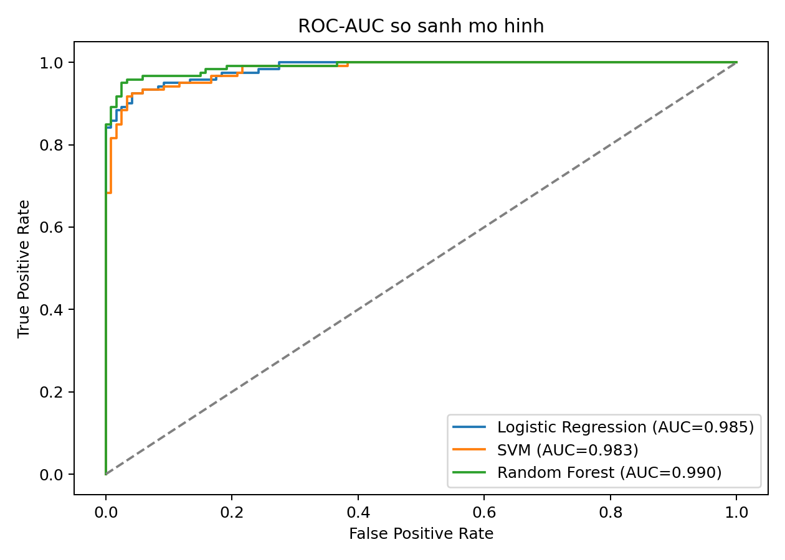
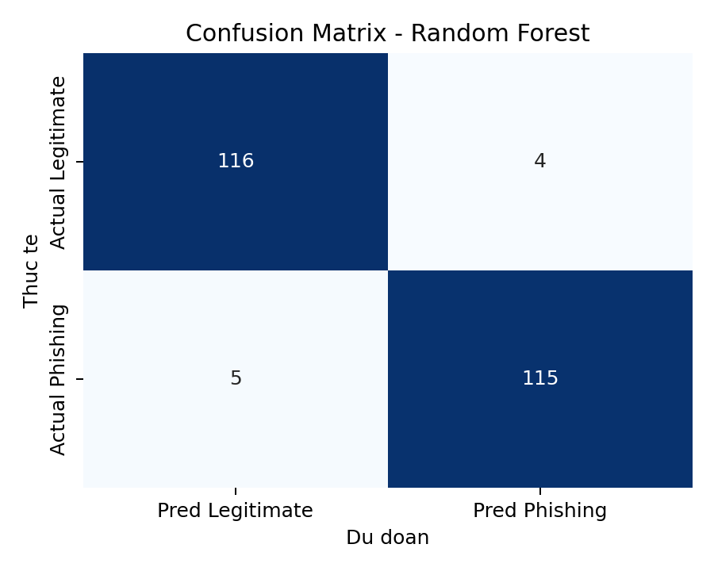
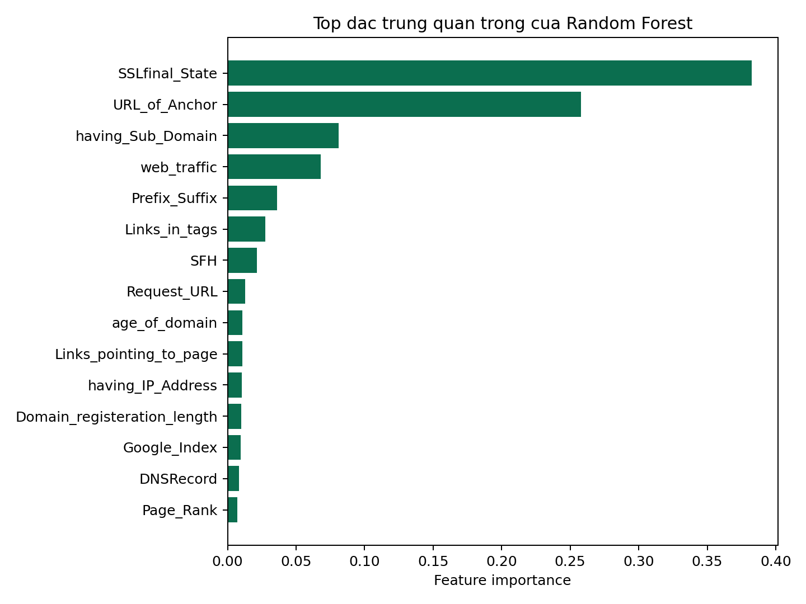
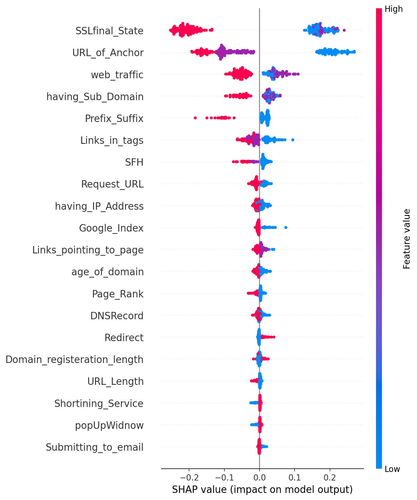

# BÁO CÁO KẾT MÔN

<div align="center">

**BỘ CÔNG THƯƠNG**  
**TRƯỜNG ĐẠI HỌC ĐIỆN LỰC**  
**KHOA CÔNG NGHỆ THÔNG TIN**

<br>

**BÁO CÁO KẾT MÔN HỌC PHẦN**  
**[ĐIỀN TÊN MÔN HỌC]**

<br>

**ĐỀ TÀI:**  
**CYBERSHIELD AI - PHÁT HIỆN WEBSITE PHISHING BẰNG HỌC MÁY GIÁM SÁT**

</div>

| Thông tin | Nội dung |
| --- | --- |
| Giảng viên hướng dẫn | [ĐIỀN TÊN GIẢNG VIÊN] |
| Sinh viên thực hiện | [THÀNH VIÊN 1] |
|  | [THÀNH VIÊN 2] |
|  | [THÀNH VIÊN 3] |
| Ngành | Công nghệ thông tin |
| Chuyên ngành | [ĐIỀN CHUYÊN NGÀNH] |
| Lớp | [ĐIỀN LỚP] |
| Khóa | [ĐIỀN KHÓA] |

<div align="center">

Hà Nội, năm 2026

</div>

---

# PHIẾU CHẤM ĐIỂM

| Họ và tên giảng viên chấm | Điểm | Chữ ký | Ghi chú |
| --- | --- | --- | --- |
| Giảng viên chấm 1 |  |  |  |
| Giảng viên chấm 2 |  |  |  |

| STT | Họ và tên sinh viên | Điểm | Chữ ký |
| --- | --- | --- | --- |
| 1 | [THÀNH VIÊN 1] |  |  |
| 2 | [THÀNH VIÊN 2] |  |  |
| 3 | [THÀNH VIÊN 3] |  |  |

---

# MỤC LỤC

1. [Lời cảm ơn](#lời-cảm-ơn)
2. [Mở đầu](#mở-đầu)
3. [Chương 1: Tổng quan về học máy và bài toán phát hiện phishing website](#chương-1-tổng-quan-về-học-máy-và-bài-toán-phát-hiện-phishing-website)
4. [Chương 2: Phương pháp đề xuất và xây dựng hệ thống CyberShield AI](#chương-2-phương-pháp-đề-xuất-và-xây-dựng-hệ-thống-cybershield-ai)
5. [Chương 3: Thực nghiệm và đánh giá](#chương-3-thực-nghiệm-và-đánh-giá)
6. [Kết luận](#kết-luận)
7. [Tài liệu tham khảo](#tài-liệu-tham-khảo)

---

# DANH MỤC HÌNH ẢNH

1. Hình 2.1. Quy trình huấn luyện và đánh giá mô hình
2. Hình 3.1. Đường cong ROC-AUC so sánh ba mô hình
3. Hình 3.2. Confusion matrix của mô hình Random Forest
4. Hình 3.3. Độ quan trọng đặc trưng của Random Forest
5. Hình 3.4. Biểu đồ SHAP summary

---

# LỜI CẢM ƠN

Nhóm chúng em xin chân thành cảm ơn giảng viên phụ trách học phần [ĐIỀN TÊN MÔN HỌC] đã tận tình giảng dạy, định hướng kiến thức và hỗ trợ chúng em trong suốt quá trình học tập cũng như thực hiện bài báo cáo kết môn này. Những kiến thức nền tảng về học máy, khai phá dữ liệu và phương pháp nghiên cứu khoa học mà thầy/cô truyền đạt là cơ sở quan trọng để nhóm từng bước xây dựng và hoàn thiện đề tài.

Chúng em cũng xin cảm ơn Khoa Công nghệ thông tin, Trường Đại học Điện lực đã tạo điều kiện thuận lợi về môi trường học tập, tài nguyên tham khảo và định hướng chuyên môn để sinh viên có thể tiếp cận các bài toán thực tế gắn với an ninh mạng và trí tuệ nhân tạo. Điều này giúp đề tài không chỉ dừng lại ở mức tìm hiểu lý thuyết mà còn có cơ hội được triển khai dưới dạng một hệ thống có thể chạy thử nghiệm.

Trong quá trình thực hiện, mặc dù nhóm đã cố gắng rà soát và hoàn thiện nội dung một cách nghiêm túc, báo cáo chắc chắn vẫn còn những hạn chế nhất định về phạm vi thực nghiệm và mức độ hoàn thiện của hệ thống. Nhóm rất mong nhận được những góp ý từ thầy/cô để có thể tiếp tục bổ sung, chỉnh sửa và phát triển đề tài trong tương lai.

Nhóm xin chân thành cảm ơn.

---

# MỞ ĐẦU

## 1. Lý do chọn đề tài

Trong những năm gần đây, tấn công phishing đã trở thành một trong những hình thức lừa đảo phổ biến nhất trên môi trường số. Kẻ tấn công thường tạo ra các đường dẫn và website có giao diện hoặc tên miền gần giống với dịch vụ hợp lệ như ngân hàng, ví điện tử, mạng xã hội hoặc cổng đăng nhập doanh nghiệp. Khi người dùng truy cập vào các website này và nhập thông tin xác thực, dữ liệu có thể bị đánh cắp, dẫn đến mất tài khoản, rò rỉ thông tin cá nhân và thiệt hại tài chính.

Trong bối cảnh đó, việc xây dựng các hệ thống có khả năng phát hiện URL hoặc website phishing một cách tự động là rất cần thiết. Đây là một bài toán phù hợp với học máy vì dữ liệu URL và các tín hiệu liên quan như cấu trúc tên miền, chứng chỉ SSL, hành vi HTML, DNS và độ phổ biến tên miền có thể được chuyển thành các đặc trưng định lượng để mô hình học cách phân biệt giữa website hợp lệ và website lừa đảo.

Từ nhu cầu thực tế trên, nhóm lựa chọn đề tài **CyberShield AI - Phát hiện website phishing bằng học máy giám sát**. Điểm nổi bật của đề tài là không chỉ huấn luyện mô hình phân loại mà còn xây dựng một quy trình khép kín gồm: tải dữ liệu chuẩn học thuật, bóc tách 30 đặc trưng theo chuẩn UCI, so sánh nhiều mô hình, tinh chỉnh mô hình tốt nhất, giải thích dự đoán bằng SHAP và triển khai một ứng dụng Streamlit để quét URL trực tiếp.

## 2. Mục tiêu nghiên cứu

Đề tài được thực hiện với các mục tiêu chính sau:

- Nghiên cứu tổng quan về học máy giám sát và bài toán phát hiện website phishing.
- Xây dựng tập đặc trưng bám theo bộ dữ liệu chuẩn UCI Phishing Websites Dataset.
- So sánh hiệu quả của ba mô hình `Logistic Regression`, `SVM` và `Random Forest`.
- Lựa chọn mô hình có hiệu quả tốt nhất dựa trên các chỉ số đánh giá phù hợp với bài toán an ninh mạng.
- Áp dụng SHAP để giải thích quyết định của mô hình đối với từng URL.
- Xây dựng ứng dụng demo cho phép quét URL, dự đoán rủi ro và hiển thị các tín hiệu kỹ thuật liên quan.

## 3. Đối tượng và phạm vi nghiên cứu

Đối tượng nghiên cứu của đề tài là các website hoặc URL có dấu hiệu lừa đảo, đặc biệt là những đường dẫn giả mạo thương hiệu, sử dụng cấu trúc tên miền đánh lừa, chèn ký tự đặc biệt, dùng IP thay domain, hoặc có hành vi HTML và mạng bất thường.

Phạm vi nghiên cứu tập trung vào:

- Bộ dữ liệu chuẩn `UCI Phishing Websites Dataset`.
- Bài toán phân loại nhị phân `phishing` và `legitimate`.
- 30 đặc trưng đầu vào mô phỏng theo schema UCI.
- Ba mô hình học máy giám sát phổ biến trong bài toán phân loại.
- Ứng dụng demo trên môi trường cục bộ với `Streamlit`.

Đề tài chưa mở rộng sang các hướng như deep learning, thu thập dữ liệu thời gian thực quy mô lớn, hay triển khai hệ thống phân tán phục vụ lưu lượng cao.

## 4. Phương pháp nghiên cứu

Đề tài sử dụng kết hợp các phương pháp:

- Nghiên cứu lý thuyết về học máy giám sát, phân loại nhị phân, đánh giá mô hình và giải thích mô hình.
- Nghiên cứu dữ liệu chuẩn từ UCI để kế thừa hệ đặc trưng học thuật có khả năng so sánh và tái lập.
- Thực nghiệm trên mã nguồn Python với các thư viện `pandas`, `scikit-learn`, `shap`, `matplotlib`, `seaborn`, `streamlit`.
- Phân tích định lượng dựa trên các chỉ số `Accuracy`, `Precision`, `Recall`, `F1-score`, `ROC-AUC`, confusion matrix và feature importance.

## 5. Bố cục báo cáo

Báo cáo gồm ba chương chính:

- Chương 1 trình bày cơ sở lý thuyết về học máy và bài toán phát hiện phishing website.
- Chương 2 mô tả bộ dữ liệu, đặc trưng, mô hình và kiến trúc hệ thống CyberShield AI.
- Chương 3 trình bày thực nghiệm, phân tích kết quả và đánh giá hệ thống.

---

# CHƯƠNG 1: TỔNG QUAN VỀ HỌC MÁY VÀ BÀI TOÁN PHÁT HIỆN PHISHING WEBSITE

## 1.1. Khái niệm về học máy

Học máy (Machine Learning) là một nhánh của trí tuệ nhân tạo cho phép máy tính học ra quy luật từ dữ liệu thay vì chỉ thực hiện các quy tắc được lập trình cứng. Thông qua quá trình huấn luyện trên dữ liệu lịch sử, mô hình học máy có thể xây dựng hàm ánh xạ từ đầu vào sang đầu ra và đưa ra dự đoán cho các trường hợp chưa từng gặp.

Điểm cốt lõi của học máy là khả năng khái quát hóa. Một mô hình tốt không chỉ ghi nhớ dữ liệu huấn luyện mà còn phải hoạt động ổn định trên dữ liệu mới. Vì vậy, ngoài việc tối ưu độ chính xác trên tập train, quá trình xây dựng hệ thống còn phải chú ý đến việc chia dữ liệu, kiểm định chéo và đánh giá trên tập kiểm tra độc lập.

## 1.2. Học máy có giám sát trong bài toán phân loại

Học máy có giám sát là nhánh phù hợp nhất với đề tài này. Trong phương pháp này, mỗi mẫu dữ liệu huấn luyện đều đi kèm một nhãn đúng. Mô hình học cách liên hệ giữa các đặc trưng đầu vào với nhãn đầu ra, sau đó dùng quan hệ đã học để dự đoán cho dữ liệu mới.

Với đề tài CyberShield AI, nhãn đầu ra chỉ gồm hai lớp:

- `0 = legitimate`: website hợp lệ.
- `1 = phishing`: website lừa đảo.

Bài toán vì vậy là một bài toán **phân loại nhị phân**. Đầu vào là vector 30 đặc trưng mô tả URL và môi trường website; đầu ra là xác suất và nhãn phân loại cho biết URL có khả năng phishing hay không.

## 1.3. Tổng quan về phishing website

Phishing website là website được tạo ra nhằm giả mạo một thực thể hợp pháp để đánh cắp thông tin của người dùng. Các website này thường nhắm tới:

- Tài khoản ngân hàng hoặc ví điện tử.
- Tài khoản mạng xã hội và email.
- Tài khoản đăng nhập nội bộ doanh nghiệp.
- Mã OTP, mật khẩu, số thẻ và thông tin định danh cá nhân.

Một số kỹ thuật phổ biến của website phishing gồm:

- Giả mạo thương hiệu trong tên miền, ví dụ chèn tên thương hiệu vào subdomain hoặc domain phụ.
- Dùng dấu `@`, dấu `-`, hoặc chuỗi `https` đánh lừa người dùng.
- Dùng IP thay cho tên miền để che giấu nguồn gốc.
- Tạo URL rất dài để làm nhiễu phần domain thật.
- Chèn form đăng nhập hoặc form gửi dữ liệu về máy chủ khác.
- Tận dụng HTTPS yếu hoặc chứng chỉ ngắn hạn để tăng cảm giác hợp lệ.

Do các dấu hiệu này có thể được biểu diễn thành đặc trưng định lượng, phishing detection là một bài toán rất phù hợp cho học máy giám sát.

## 1.4. Ý nghĩa thực tiễn của phát hiện phishing website

Khả năng phát hiện sớm website phishing có ý nghĩa lớn trong thực tế:

- Hỗ trợ bảo vệ người dùng cuối trước các cuộc tấn công đánh cắp tài khoản.
- Giảm thiểu rủi ro tài chính, mất quyền truy cập và lộ dữ liệu nhạy cảm.
- Hỗ trợ bộ phận an ninh mạng sàng lọc URL nghi ngờ trong email, tin nhắn hoặc log truy cập.
- Tăng khả năng cảnh báo sớm trong các hệ thống giám sát SOC, SIEM hoặc gateway bảo mật.

Trong môi trường học thuật, bài toán này còn là ví dụ điển hình cho việc kết hợp giữa khoa học dữ liệu, an ninh mạng và triển khai ứng dụng thực tế.

## 1.5. Các chỉ số đánh giá quan trọng

Trong bài toán an ninh mạng, không thể chỉ nhìn vào `Accuracy`. Một hệ thống có accuracy cao nhưng bỏ sót nhiều website lừa đảo vẫn là hệ thống nguy hiểm khi triển khai thực tế. Vì vậy, đề tài sử dụng đồng thời nhiều chỉ số:

### 1.5.1. Accuracy

Accuracy đo tỷ lệ dự đoán đúng trên toàn bộ mẫu:

\[
Accuracy = \frac{TP + TN}{TP + TN + FP + FN}
\]

Tuy nhiên, chỉ số này dễ gây ảo giác nếu dữ liệu mất cân bằng hoặc chi phí sai lầm giữa hai lớp khác nhau.

### 1.5.2. Precision

Precision đo tỷ lệ các mẫu bị dự đoán là phishing mà thực sự là phishing:

\[
Precision = \frac{TP}{TP + FP}
\]

Precision cao giúp giảm `False Positive`, tức giảm tình trạng chặn nhầm các website hợp lệ.

### 1.5.3. Recall

Recall đo tỷ lệ website phishing thực sự được mô hình phát hiện đúng:

\[
Recall = \frac{TP}{TP + FN}
\]

Recall cao giúp giảm `False Negative`, tức giảm nguy cơ bỏ sót website lừa đảo.

### 1.5.4. F1-score

F1-score là trung bình điều hòa giữa Precision và Recall:

\[
F1 = \frac{2 \times Precision \times Recall}{Precision + Recall}
\]

Đây là chỉ số rất quan trọng trong bài toán phishing detection vì nó cân bằng giữa việc giảm báo động giả và giảm bỏ sót mối đe dọa.

### 1.5.5. ROC-AUC

ROC-AUC đo khả năng phân tách hai lớp của mô hình trên nhiều ngưỡng khác nhau. Chỉ số càng gần 1 thì mô hình càng tốt trong việc phân biệt giữa website phishing và website hợp lệ. Đây là thước đo quan trọng khi đánh giá mô hình phân loại xác suất.

## 1.6. Kết luận chương 1

Chương 1 đã trình bày nền tảng lý thuyết cho đề tài, bao gồm khái niệm học máy, học có giám sát, phân loại nhị phân và đặc điểm của bài toán phát hiện website phishing. Bên cạnh đó, chương này cũng nhấn mạnh vai trò của các chỉ số đánh giá như Precision, Recall, F1-score và ROC-AUC trong bối cảnh an ninh mạng. Những nội dung này là cơ sở để triển khai kiến trúc hệ thống và thực nghiệm ở các chương tiếp theo.

---

# CHƯƠNG 2: PHƯƠNG PHÁP ĐỀ XUẤT VÀ XÂY DỰNG HỆ THỐNG CYBERSHIELD AI

## 2.1. Tổng quan hệ thống

CyberShield AI là một hệ thống phát hiện website phishing được xây dựng theo hướng học máy giám sát, kết hợp giữa dữ liệu chuẩn học thuật và các tín hiệu runtime khi quét URL thực tế. Hệ thống gồm ba khối chính:

- Khối dữ liệu và đặc trưng.
- Khối huấn luyện và đánh giá mô hình.
- Khối suy luận và giải thích kết quả trên ứng dụng demo.

Về mặt mã nguồn, hệ thống được tổ chức thành các thành phần chính:

- `cybershield_ai/data_loader.py`: tải và chuẩn hóa dữ liệu UCI.
- `cybershield_ai/feature_extraction.py`: bóc tách đặc trưng từ URL, HTML, WHOIS, DNS, SSL và reputation feed.
- `cybershield_ai/modeling.py`: xây dựng mô hình, đánh giá và trực quan hóa.
- `cybershield_ai/training_pipeline.py`: điều phối toàn bộ quy trình train, evaluate, export artifact.
- `cybershield_ai/xai.py`: tạo SHAP explainer và trích xuất giải thích cho lớp phishing.
- `app.py`: ứng dụng Streamlit để quét URL và hiển thị kết quả.

## 2.2. Bộ dữ liệu sử dụng

Đề tài sử dụng `UCI Phishing Websites Dataset`, một bộ dữ liệu học thuật phổ biến trong nghiên cứu phát hiện website lừa đảo. Theo mã nguồn hiện tại, bộ dữ liệu được nạp từ file ARFF nằm trong gói nén UCI và được ánh xạ như sau:

- `Result = -1` được quy đổi thành `is_phishing = 1`.
- `Result = 1` được quy đổi thành `is_phishing = 0`.

Khi nạp dữ liệu từ repo, tập dữ liệu có:

| Thuộc tính | Giá trị |
| --- | --- |
| Số lượng mẫu | 11,055 |
| Số lượng đặc trưng | 30 |
| Số mẫu `legitimate` | 6,157 |
| Số mẫu `phishing` | 4,898 |

Hệ đặc trưng này là điểm mạnh của đề tài vì cho phép giữ tính học thuật, dễ so sánh với tài liệu nghiên cứu, đồng thời vẫn có thể tái hiện một phần trong quá trình quét URL thời gian thực.

## 2.3. Hệ đặc trưng của đề tài

CyberShield AI giữ nguyên schema 30 đặc trưng chuẩn UCI ở cả giai đoạn huấn luyện lẫn suy luận. Các đặc trưng có thể được nhóm thành bốn lớp chính như sau.

| Nhóm đặc trưng | Một số thuộc tính tiêu biểu | Ý nghĩa |
| --- | --- | --- |
| Đặc trưng hình thái URL | `having_IP_Address`, `URL_Length`, `having_At_Symbol`, `double_slash_redirecting`, `Prefix_Suffix`, `having_Sub_Domain`, `HTTPS_token` | Phát hiện các dấu hiệu ngụy trang trong cấu trúc URL và tên miền |
| Đặc trưng hạ tầng tên miền | `SSLfinal_State`, `Domain_registeration_length`, `age_of_domain`, `DNSRecord`, `web_traffic`, `Page_Rank`, `Google_Index` | Mô tả mức độ tin cậy, tuổi thọ và độ phổ biến của tên miền |
| Đặc trưng HTML và hành vi trang | `Favicon`, `Request_URL`, `URL_of_Anchor`, `Links_in_tags`, `SFH`, `Submitting_to_email`, `Redirect`, `on_mouseover`, `RightClick`, `popUpWidnow`, `Iframe` | Phản ánh mức độ bất thường trong cấu trúc HTML và hành vi phía trình duyệt |
| Đặc trưng danh tiếng và liên kết | `Abnormal_URL`, `Links_pointing_to_page`, `Statistical_report` | Bổ sung tín hiệu từ WHOIS, công cụ tìm kiếm và feed phishing công khai |

Các đặc trưng trong hệ thống được bóc tách từ nhiều nguồn:

- Cấu trúc URL và tên miền.
- Phản hồi HTTP và HTML tải về.
- WHOIS và DNS.
- Chứng chỉ SSL.
- Mức độ phổ biến tên miền từ các nguồn xếp hạng.
- Feed phishing công khai như OpenPhish và URLhaus.

Khi một truy vấn live bị lỗi hoặc không lấy được dữ liệu, hệ thống dùng `feature defaults` được suy ra từ mode của tập huấn luyện để đảm bảo vẫn có thể trả về kết quả. Cơ chế này giúp hệ thống hoạt động ổn định hơn trong điều kiện mạng thực tế.

## 2.4. Quy trình huấn luyện và đánh giá

Quy trình huấn luyện trong `training_pipeline.py` được tổ chức thành các bước sau:

1. Tạo các thư mục dự án và artifact nếu chưa tồn tại.
2. Nạp bộ dữ liệu UCI và tách thành `X`, `y`.
3. Chia dữ liệu train/test theo tỷ lệ `80/20` bằng `train_test_split` với `stratify=y`.
4. Tính `feature_defaults` từ tập train để dùng cho giai đoạn quét URL thực tế.
5. Xây dựng ba mô hình ứng viên.
6. Đánh giá chéo bằng `StratifiedKFold(n_splits=5, shuffle=True, random_state=42)`.
7. Tinh chỉnh `Random Forest` bằng `GridSearchCV`.
8. Huấn luyện các mô hình cuối cùng và đánh giá trên tập test.
9. Sinh artifact gồm model, classification report, confusion matrix, ROC curve, feature importance, SHAP summary và file JSON tổng hợp metric.

**Hình 2.1. Quy trình huấn luyện và đánh giá mô hình**

```text
UCI Dataset
    -> chia train/test
    -> tính feature defaults
    -> Logistic Regression / SVM / Random Forest
    -> Stratified 5-Fold CV
    -> GridSearchCV cho Random Forest
    -> đánh giá trên test set
    -> lưu model + reports + SHAP + plots
```

Các lệnh chính để vận hành hệ thống gồm:

```bash
python train.py
streamlit run app.py
```

Ngoài chế độ đầy đủ, pipeline còn hỗ trợ chạy nhanh bằng:

```bash
python train.py --quick --sample-size 2000
```

Điều này hữu ích cho kiểm thử nhanh trong quá trình phát triển.

## 2.5. Các mô hình được so sánh

### 2.5.1. Logistic Regression

Logistic Regression là mô hình tuyến tính rất phổ biến trong bài toán phân loại nhị phân. Mô hình dự đoán xác suất thuộc lớp phishing theo công thức:

\[
P(y=1|x)=\sigma(w^Tx+b)
\]

Trong đó \(\sigma\) là hàm sigmoid. Ưu điểm của Logistic Regression là:

- Đơn giản, dễ huấn luyện.
- Dễ diễn giải về mặt xác suất.
- Hoạt động tốt khi ranh giới phân lớp gần tuyến tính.

Trong mã nguồn hiện tại, Logistic Regression được ghép với `StandardScaler` và sử dụng `class_weight="balanced"` để hạn chế ảnh hưởng của mất cân bằng nhãn.

### 2.5.2. SVM

SVM (Support Vector Machine) tìm siêu phẳng tối ưu để tách hai lớp với biên lớn nhất. Trong đề tài, mô hình SVM được triển khai với:

- `kernel="rbf"`
- `probability=True`
- `class_weight="balanced"`

Ưu điểm của SVM là khả năng xử lý tốt các ranh giới phân lớp phi tuyến, đặc biệt khi kết hợp kernel phù hợp. Tuy nhiên, chi phí huấn luyện và suy luận có thể cao hơn so với các mô hình đơn giản.

### 2.5.3. Random Forest

Random Forest là mô hình tổ hợp gồm nhiều cây quyết định. Mỗi cây học từ một tập con của dữ liệu và đặc trưng; đầu ra cuối cùng được xác định theo nguyên tắc bỏ phiếu hoặc trung bình xác suất. Ưu điểm chính của Random Forest là:

- Khả năng mô hình hóa quan hệ phi tuyến.
- Chống overfitting tốt hơn một cây đơn.
- Tự nhiên hỗ trợ xếp hạng độ quan trọng đặc trưng.
- Phù hợp với dữ liệu dạng bảng và đặc trưng hỗn hợp như bài toán phishing.

Vì những lý do này, Random Forest là mô hình tiềm năng nhất trong đề tài và được chọn để tinh chỉnh tham số chi tiết bằng Grid Search.

## 2.6. Kiểm định chéo và tinh chỉnh tham số

Đề tài sử dụng `Stratified 5-Fold Cross-Validation` để đảm bảo mỗi fold giữ được tỷ lệ nhãn tương đối ổn định. Đây là lựa chọn phù hợp vì:

- Giảm phụ thuộc vào một lần chia dữ liệu ngẫu nhiên.
- Cho cái nhìn ổn định hơn về hiệu suất tổng quát của mô hình.
- Đặc biệt hữu ích trong các bài toán phân loại có chi phí sai lầm không đối xứng.

Trong lần thực nghiệm được lưu trong `artifacts/reports/metrics_summary.json`, Random Forest tốt nhất thu được các tham số:

| Tham số | Giá trị |
| --- | --- |
| `n_estimators` | 100 |
| `max_depth` | 12 |
| `min_samples_split` | 5 |
| `min_samples_leaf` | 2 |
| `max_features` | `sqrt` |
| `class_weight` | `None` |

Những tham số này cho thấy mô hình được kiểm soát ở mức vừa phải về độ sâu và số lượng cây, giúp cân bằng giữa khả năng học đặc trưng và nguy cơ quá khớp trên mẫu nhỏ hơn.

## 2.7. Giải thích mô hình bằng SHAP

Một hạn chế thường gặp của các mô hình tổ hợp như Random Forest là khó giải thích trực tiếp lý do tại sao một URL bị gắn nhãn phishing. Để khắc phục điều này, đề tài áp dụng `SHAP (SHapley Additive exPlanations)`.

Vai trò của SHAP trong hệ thống gồm:

- Giải thích đóng góp của từng đặc trưng vào dự đoán lớp phishing.
- Hiển thị biểu đồ waterfall cho từng URL trên giao diện Streamlit.
- Tạo biểu đồ summary ở mức toàn cục để phân tích những đặc trưng ảnh hưởng nhiều nhất đến mô hình.

Nhờ SHAP, hệ thống không chỉ trả lời câu hỏi "URL này có nguy hiểm hay không" mà còn trả lời thêm "vì sao mô hình đánh giá URL này là nguy hiểm". Đây là điểm rất có giá trị về mặt học thuật và ứng dụng.

## 2.8. Ứng dụng demo Streamlit

Ứng dụng `app.py` giúp đưa mô hình từ môi trường nghiên cứu sang dạng thử nghiệm thực tế. Khi người dùng nhập một URL, hệ thống sẽ:

1. Chuẩn hóa URL.
2. Bóc tách các đặc trưng runtime bằng `scan_url`.
3. Dự đoán xác suất phishing bằng model đã huấn luyện.
4. Gán mức rủi ro và nhóm kịch bản tấn công nghi ngờ.
5. Hiển thị giải thích SHAP và bằng chứng kỹ thuật.

Ngoài nhãn phân loại, ứng dụng còn mô tả các nhóm rủi ro như:

- Credential Phishing
- Malware Delivery
- Scam / Fraud
- Brand Impersonation
- Suspicious Redirect / Obfuscation

Điều này làm tăng tính thực dụng của hệ thống, vì kết quả không còn chỉ là `0` hoặc `1` mà đã gần hơn với ngôn ngữ của người dùng và nhà phân tích an ninh mạng.

## 2.9. Kết luận chương 2

Chương 2 đã trình bày toàn bộ phương pháp và kiến trúc của CyberShield AI, từ dữ liệu đầu vào, hệ đặc trưng, pipeline huấn luyện, ba mô hình so sánh, chiến lược đánh giá đến cơ chế giải thích bằng SHAP và triển khai giao diện demo. Có thể thấy hệ thống được thiết kế theo hướng vừa bám chuẩn học thuật vừa có khả năng vận hành trong thực tế, tạo nền tảng rõ ràng cho phần thực nghiệm ở chương 3.

---

# CHƯƠNG 3: THỰC NGHIỆM VÀ ĐÁNH GIÁ

## 3.1. Môi trường và cấu hình thực nghiệm

Các kết quả trong chương này được lấy trực tiếp từ file `artifacts/reports/metrics_summary.json` và các artifact đi kèm trong thư mục `artifacts/reports/`. Điều này giúp bảo đảm nội dung báo cáo bám sát đúng repo hiện tại.

Tập dữ liệu gốc gồm 11,055 mẫu, tuy nhiên bộ kết quả thực nghiệm được lưu trong repo phản ánh một lần chạy có tập kiểm tra gồm 240 mẫu, trong đó:

- 120 mẫu `legitimate`
- 120 mẫu `phishing`

Cách bố trí như vậy giúp việc so sánh precision, recall và F1-score trên hai lớp trở nên rõ ràng hơn.

## 3.2. Kết quả kiểm định chéo 5-fold

Bảng 3.1 trình bày kết quả trung bình trên 5 fold đối với ba mô hình.

**Bảng 3.1. Kết quả cross-validation**

| Mô hình | Accuracy | Precision | Recall | F1-score | ROC-AUC |
| --- | ---: | ---: | ---: | ---: | ---: |
| Random Forest | 94.27% | 94.61% | 93.96% | 94.25% | 98.83% |
| SVM | 93.13% | 94.12% | 92.08% | 93.03% | 97.62% |
| Logistic Regression | 92.92% | 93.70% | 92.08% | 92.85% | 98.16% |

Nhận xét:

- `Random Forest` đứng đầu ở cả Accuracy, Recall, F1-score và ROC-AUC.
- `SVM` đạt Precision khá cao nhưng Recall thấp hơn Random Forest.
- `Logistic Regression` cho kết quả ổn định nhưng kém hơn hai mô hình còn lại ở F1-score.

Vì bài toán phishing detection đòi hỏi cân bằng giữa giảm bỏ sót website lừa đảo và giảm cảnh báo giả, `F1-score` là tiêu chí rất quan trọng. Với F1-score cao nhất, Random Forest trở thành ứng viên phù hợp nhất để chọn làm mô hình cuối cùng.

## 3.3. Kết quả trên tập kiểm tra

Bảng 3.2 trình bày kết quả đánh giá trên tập test lưu trong artifact của repo.

**Bảng 3.2. Kết quả trên tập kiểm tra**

| Mô hình | Accuracy | Macro Precision | Macro Recall | Macro F1-score | ROC-AUC |
| --- | ---: | ---: | ---: | ---: | ---: |
| Logistic Regression | 93.33% | 93.35% | 93.33% | 93.33% | 98.53% |
| SVM | 94.17% | 94.28% | 94.17% | 94.16% | 98.25% |
| Random Forest | 96.25% | 96.25% | 96.25% | 96.25% | 99.04% |

Kết quả này một lần nữa khẳng định Random Forest là mô hình tốt nhất trong ba mô hình được khảo sát. Đáng chú ý:

- Accuracy của Random Forest đạt `96.25%`.
- ROC-AUC đạt `0.9904`, cho thấy khả năng phân biệt giữa hai lớp rất mạnh.
- Macro F1-score đạt `96.25%`, chứng tỏ mô hình giữ được sự cân bằng tốt trên cả hai lớp.

## 3.4. Phân tích chi tiết mô hình Random Forest

### 3.4.1. Classification report

Từ file `classification_report_random_forest.txt`, mô hình Random Forest đạt:

| Lớp | Precision | Recall | F1-score | Support |
| --- | ---: | ---: | ---: | ---: |
| legitimate | 95.87% | 96.67% | 96.27% | 120 |
| phishing | 96.64% | 95.83% | 96.23% | 120 |

Điều này cho thấy mô hình không thiên lệch mạnh về một phía. Cả website hợp lệ và phishing đều được nhận diện ở mức cao, giúp hệ thống có thể áp dụng tốt hơn trong bối cảnh thực tế.

### 3.4.2. Confusion matrix

Từ classification report có thể suy ra confusion matrix của Random Forest như sau:

| Thực tế \\ Dự đoán | legitimate | phishing |
| --- | ---: | ---: |
| legitimate | 116 | 4 |
| phishing | 5 | 115 |

Nhận xét:

- Chỉ có `4` trường hợp chặn nhầm website hợp lệ.
- Chỉ có `5` trường hợp bỏ sót website phishing.

Trong bài toán bảo mật, đây là kết quả tích cực vì hai loại sai lầm đều được kiểm soát ở mức thấp.

**Hình 3.1. Đường cong ROC-AUC so sánh ba mô hình**



**Hình 3.2. Confusion matrix của mô hình Random Forest**



## 3.5. Phân tích đặc trưng quan trọng

Một ưu điểm nổi bật của Random Forest là cho phép đo độ quan trọng của từng đặc trưng. Theo file `random_forest_feature_importance.csv`, năm đặc trưng quan trọng nhất là:

| Xếp hạng | Đặc trưng | Importance | Diễn giải |
| --- | --- | ---: | --- |
| 1 | `SSLfinal_State` | 0.3825 | Mức độ tin cậy của HTTPS và chứng chỉ SSL |
| 2 | `URL_of_Anchor` | 0.2579 | Tỷ lệ anchor bất thường hoặc trỏ ra ngoài |
| 3 | `having_Sub_Domain` | 0.0811 | Số lượng subdomain đáng ngờ |
| 4 | `web_traffic` | 0.0682 | Mức độ phổ biến tên miền |
| 5 | `Prefix_Suffix` | 0.0360 | Tên miền có dấu gạch ngang gây nhầm lẫn |

Những kết quả này rất phù hợp với bản chất của phishing website:

- Website phishing thường dùng HTTPS yếu hoặc chứng chỉ thiếu tin cậy.
- Nhiều website lừa đảo có cấu trúc anchor và tài nguyên ngoài miền bất thường.
- Tên miền giả mạo thường lạm dụng subdomain và dấu gạch ngang để bắt chước thương hiệu.
- Những tên miền độc hại thường có mức độ phổ biến thấp hơn các dịch vụ hợp lệ.

**Hình 3.3. Độ quan trọng đặc trưng của Random Forest**



## 3.6. Vai trò của SHAP trong giải thích mô hình

Ngoài feature importance ở mức toàn cục, đề tài còn sử dụng SHAP để giải thích dự đoán theo từng mẫu. Đây là khác biệt quan trọng giữa một hệ thống chỉ cho ra nhãn và một hệ thống có khả năng hỗ trợ phân tích.

SHAP đem lại ba lợi ích chính:

- Chỉ ra đặc trưng nào đang làm tăng xác suất phishing của một URL cụ thể.
- Hỗ trợ người dùng hiểu vì sao hệ thống đưa ra cảnh báo.
- Tăng độ tin cậy khi áp dụng mô hình vào bối cảnh bán thực tế hoặc demo học thuật.

Trong ứng dụng Streamlit, SHAP được hiển thị dưới dạng waterfall plot và câu tóm tắt ngắn, ví dụ mô hình có thể cho biết rủi ro tăng do:

- URL quá dài.
- Có nhiều subdomain.
- SSL không mạnh.
- Anchor bất thường.

**Hình 3.4. Biểu đồ SHAP summary**



## 3.7. Ý nghĩa thực tiễn của ứng dụng demo

Ứng dụng `Streamlit` của đề tài không chỉ là phần minh họa giao diện mà còn thể hiện khả năng chuyển hóa từ mô hình học thuật sang một quy trình sử dụng được:

- Người dùng nhập URL trực tiếp.
- Hệ thống tự bóc tách đặc trưng.
- Mô hình dự đoán xác suất phishing.
- Hệ thống gán loại rủi ro như giả mạo thương hiệu, đánh cắp tài khoản hoặc chuyển hướng che giấu.
- SHAP giải thích nguyên nhân cảnh báo.
- Phần "bằng chứng kỹ thuật" giúp người dùng và người chấm hiểu từng tín hiệu cụ thể.

Điều này làm tăng giá trị của đề tài ở hai khía cạnh:

- Giá trị học thuật: có dữ liệu, mô hình, đánh giá, XAI.
- Giá trị ứng dụng: có luồng thao tác gần giống một sản phẩm thử nghiệm.

## 3.8. Hạn chế của đề tài

Mặc dù đạt kết quả tốt, đề tài vẫn còn một số hạn chế:

- Một số đặc trưng runtime phụ thuộc vào truy vấn live như WHOIS, DNS, HTML, SSL hoặc feed phishing công khai.
- Khi mạng lỗi hoặc nguồn bên ngoài không phản hồi, hệ thống phải dùng `fallback features`.
- Bộ kết quả thực nghiệm đang lưu trong repo phản ánh một lần chạy cụ thể; để có đánh giá đầy đủ hơn, cần thêm nhiều lần thí nghiệm với cấu hình khác nhau.
- Hệ thống hiện tập trung vào dữ liệu dạng bảng và chưa mở rộng sang mô hình học sâu hoặc dữ liệu nội dung trang phong phú hơn.

Tuy nhiên, các hạn chế này không làm mất đi giá trị của đề tài; ngược lại, chúng chỉ ra các hướng phát triển tiếp theo rất rõ ràng.

## 3.9. Kết luận chương 3

Chương 3 đã trình bày kết quả thực nghiệm của CyberShield AI trên dữ liệu và artifact hiện có trong repo. Kết quả cho thấy `Random Forest` là mô hình nổi trội nhất trong ba mô hình được khảo sát, đạt Accuracy `96.25%`, Macro F1-score `96.25%` và ROC-AUC `99.04%`. Bên cạnh đó, các biểu đồ confusion matrix, ROC-AUC, feature importance và SHAP summary giúp khẳng định cả hiệu quả lẫn khả năng giải thích của hệ thống. Điều này chứng minh hướng tiếp cận học máy giám sát là phù hợp với bài toán phát hiện website phishing trong phạm vi đề tài.

---

# KẾT LUẬN

Đề tài **CyberShield AI - Phát hiện website phishing bằng học máy giám sát** đã giải quyết một bài toán có ý nghĩa thực tiễn cao trong lĩnh vực an ninh mạng. Trên cơ sở bộ dữ liệu chuẩn UCI và hệ đặc trưng 30 chiều, nhóm đã xây dựng được một pipeline tương đối hoàn chỉnh gồm tải dữ liệu, huấn luyện, kiểm định chéo, tinh chỉnh mô hình, đánh giá kết quả, giải thích dự đoán và triển khai ứng dụng quét URL.

Qua quá trình thực nghiệm, ba mô hình `Logistic Regression`, `SVM` và `Random Forest` đã được so sánh trực tiếp. Kết quả cho thấy `Random Forest` là lựa chọn tốt nhất trong phạm vi khảo sát, với Accuracy `96.25%`, ROC-AUC `0.9904` và khả năng cân bằng tốt giữa Precision và Recall. Đây là bằng chứng rõ ràng cho thấy học máy giám sát hoàn toàn có thể áp dụng hiệu quả vào bài toán phishing detection.

Một điểm nổi bật của đề tài là không dừng ở mức xây dựng mô hình phân loại, mà còn bổ sung:

- Giải thích mô hình bằng `SHAP`.
- Phân tích đặc trưng quan trọng.
- Phân loại ngữ cảnh rủi ro trên giao diện demo.
- Cơ chế fallback khi đặc trưng live không truy vấn được.

Những thành phần này làm cho hệ thống trở nên gần hơn với một ứng dụng hỗ trợ cảnh báo an ninh mạng thực tế, đồng thời tăng giá trị học thuật của báo cáo.

Trong tương lai, đề tài có thể tiếp tục phát triển theo các hướng:

- Mở rộng dữ liệu và bổ sung nguồn phishing mới.
- Thử nghiệm thêm các mô hình boosting hoặc deep learning.
- Tối ưu hóa tốc độ suy luận và độ ổn định của feature extraction.
- Triển khai theo thời gian thực ở cấp độ email gateway, browser extension hoặc API dịch vụ.
- Cải thiện giao diện và tăng khả năng trực quan hóa cho người dùng cuối.

Tổng kết lại, đề tài đã đạt được mục tiêu đề ra, thể hiện sự kết hợp chặt chẽ giữa kiến thức học máy, kỹ thuật phần mềm và tư duy ứng dụng trong an ninh mạng.

---

# TÀI LIỆU THAM KHẢO

1. UCI Machine Learning Repository, *Phishing Websites Data Set*.
2. Leo Breiman, *Random Forests*, Machine Learning, 2001.
3. Corinna Cortes, Vladimir Vapnik, *Support-Vector Networks*, Machine Learning, 1995.
4. Scott M. Lundberg, Su-In Lee, *A Unified Approach to Interpreting Model Predictions*, Advances in Neural Information Processing Systems, 2017.
5. scikit-learn Developers, *scikit-learn Documentation*.
6. SHAP Documentation, *SHAP: Explainable AI for machine learning models*.
7. OpenPhish, *Phishing Intelligence Feed*.
8. abuse.ch URLhaus, *URLhaus Online Malware URL Feed*.

---

# GHI CHÚ SỬ DỤNG

- Tài liệu này được soạn ở dạng Markdown để dễ hiệu chỉnh trong IDE.
- Khi nộp bản hoàn chỉnh, có thể chuyển sang Word và giữ nguyên cấu trúc hiện tại.
- Các hình minh họa đã có sẵn trong thư mục `artifacts/reports/` của repo.
- Các trường thông tin bìa đang để placeholder để nhóm điền thông tin chính thức trước khi in hoặc nộp.
